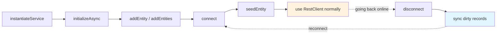

# API Reference

Complete reference for the public API of `meadow-provider-offline`. Methods are organized by the class they live on. Each has its own dedicated page with code snippets and trade-off discussion.

## Service Registration

```javascript
const libFable = require('fable');
const libMeadowProviderOffline = require('meadow-provider-offline');

const _Fable = new libFable({ Product: 'MyApp', ProductVersion: '1.0.0' });

_Fable.serviceManager.addServiceType('MeadowProviderOffline', libMeadowProviderOffline);

const tmpOffline = _Fable.serviceManager.instantiateServiceProvider('MeadowProviderOffline',
    {
        SessionDataSource: 'None',
        DefaultSessionObject: { UserID: 1, UserRole: 'User', UserRoleIndex: 1, LoggedIn: true }
    });
```

## MeadowProviderOffline

The main orchestrator service.

### Lifecycle

| Method | Purpose | Details |
|--------|---------|---------|
| [`initializeAsync(fCallback)`](api-initializeAsync.md) | Initialize sub-services and data layer | [Details](api-initializeAsync.md) |
| [`connect(pRestClient, pHeadlightRestClient?)`](api-connect.md) | Start intercepting RestClient requests | [Details](api-connect.md) |
| [`disconnect(pRestClient?)`](api-disconnect.md) | Stop intercepting; restore original behavior | [Details](api-disconnect.md) |

### Entity Management

| Method | Purpose | Details |
|--------|---------|---------|
| [`addEntity(pSchema, fCallback?)`](api-addEntity.md) | Register a single Meadow entity | [Details](api-addEntity.md) |
| [`addEntities(pSchemas, fCallback?)`](api-addEntities.md) | Register multiple entities in a single batch call | [Details](api-addEntities.md) |
| [`removeEntity(pEntityName)`](api-removeEntity.md) | Unregister an entity | [Details](api-removeEntity.md) |
| [`getEntity(pEntityName)`](api-getEntity.md) | Get entity's DAL / endpoints / schema | [Details](api-getEntity.md) |

### Data Population

| Method | Purpose | Details |
|--------|---------|---------|
| [`seedEntity(pEntityName, pRecords, fCallback?)`](api-seedEntity.md) | Clear and seed an entity's table | [Details](api-seedEntity.md) |
| [`injectRecords(pEntityName, pRecords, fCallback?)`](api-injectRecords.md) | Alias for seedEntity (semantic clarity for native app injection) | [Details](api-injectRecords.md) |

### Cache-Through Mode

| Method | Purpose | Details |
|--------|---------|---------|
| [`enableCacheThrough()`](api-enableCacheThrough.md) | Enable opportunistic caching of fall-through GETs | [Details](api-enableCacheThrough.md) |
| `disableCacheThrough()` | Disable cache-through | See [enableCacheThrough](api-enableCacheThrough.md#disabling) |

### Negative IDs

| Method | Purpose | Details |
|--------|---------|---------|
| [`enableNegativeIDs()`](api-enableNegativeIDs.md) | Enable negative-ID assignment for offline creates | [Details](api-enableNegativeIDs.md) |
| `disableNegativeIDs()` | Disable negative-ID assignment | See [enableNegativeIDs](api-enableNegativeIDs.md#disabling) |
| [`getNextNegativeID(pEntityName, fCallback)`](api-getNextNegativeID.md) | Query the next negative ID for an entity | [Details](api-getNextNegativeID.md) |
| [`remapID(pEntityName, pOldID, pNewID)`](api-remapID.md) | Remap a primary key across all tables (used after sync) | [Details](api-remapID.md) |

### Native Bridge

| Method | Purpose | Details |
|--------|---------|---------|
| [`setNativeBridge(pBridgeFunction)`](api-setNativeBridge.md) | Replace sql.js with a native SQLite bridge | [Details](api-setNativeBridge.md) |

### Properties (Accessors)

| Property | Type | Description |
|----------|------|-------------|
| `initialized` | boolean | Whether `initializeAsync()` has completed successfully |
| `useNativeBridge` | boolean | Whether a native bridge function has been set |
| `entityNames` | `string[]` | Copy of the list of registered entity names |
| `dirtyTracker` | `DirtyRecordTracker` | Access the sub-service |
| `dataCacheManager` | `DataCacheManager` | Access the sub-service (null in native bridge mode) |
| `ipcOratorManager` | `IPCOratorManager` | Access the sub-service |
| `restClientInterceptor` | `RestClientInterceptor` | Access the sub-service |
| `blobStore` | `BlobStoreManager` | Access the sub-service |

## DirtyRecordTracker

Tracks local mutations for eventual sync back to the server.

### Record Mutations

| Method | Purpose | Details |
|--------|---------|---------|
| [`trackMutation(pEntity, pID, pOperation, pRecord)`](api-trackMutation.md) | Record a create/update/delete mutation with coalescing | [Details](api-trackMutation.md) |
| [`getDirtyMutations()`](api-getDirtyMutations.md) | Get all pending mutations | [Details](api-getDirtyMutations.md) |
| `getDirtyCount()` | Count of pending mutations | See [getDirtyMutations](api-getDirtyMutations.md#count) |
| `getDirtyMutationsForEntity(pEntity)` | Mutations for a specific entity | See [getDirtyMutations](api-getDirtyMutations.md#per-entity) |
| [`clearMutation(pEntity, pID)`](api-clearMutation.md) | Clear a specific mutation after sync | [Details](api-clearMutation.md) |
| `clearEntity(pEntity)` | Clear all mutations for an entity | See [clearMutation](api-clearMutation.md#entity-wide) |
| [`clearAll()`](api-clearAll.md) | Clear all mutations (including binary) | [Details](api-clearAll.md) |
| [`hasDirtyRecords()`](api-hasDirtyRecords.md) | Whether any mutations are pending | [Details](api-hasDirtyRecords.md) |
| `hasEntityDirtyRecords(pEntity)` | Whether any mutations exist for an entity | See [hasDirtyRecords](api-hasDirtyRecords.md#per-entity) |

### Binary Mutations

| Method | Purpose | Details |
|--------|---------|---------|
| [`trackBinaryMutation(pEntity, pID, pBlobKey, pMimeType)`](api-trackBinaryMutation.md) | Record a binary upload for sync | [Details](api-trackBinaryMutation.md) |
| `getBinaryMutations()` | Get all pending binary mutations | |
| `getBinaryMutationsForEntity(pEntity)` | Binary mutations for a specific entity | |
| `clearBinaryMutation(pEntity, pID)` | Clear a specific binary mutation | |
| `hasBinaryMutations()` | Whether any binary mutations are pending | |
| `getBinaryDirtyCount()` | Count of pending binary mutations | |

## DataCacheManager

Manages the in-memory SQLite database. Accessed via `provider.dataCacheManager`.

| Method | Purpose | Details |
|--------|---------|---------|
| `initializeAsync(fCallback)` | Create the SQLite database (called internally by provider) | |
| [`createTable(pPackageSchema, fCallback)`](api-createTable.md) | Create a table from a Meadow package schema | [Details](api-createTable.md) |
| [`dropTable(pTableName, fCallback)`](api-dropTable.md) | Drop a table | [Details](api-dropTable.md) |
| `resetTable(pPackageSchema, fCallback)` | Drop and recreate a table | |
| [`seedTable(pTableName, pRecords)`](api-seedTable.md) | Clear and insert records | [Details](api-seedTable.md) |
| [`ingestRecords(pTableName, pRecords)`](api-ingestRecords.md) | Upsert records without clearing the table | [Details](api-ingestRecords.md) |
| `clearTable(pTableName)` | Delete all rows | |
| `convertPackageSchemaToTableSchema(pSchema)` | Convert Meadow package types to DDL types | |

### Property

| Property | Type | Description |
|----------|------|-------------|
| `db` | sql.js Database | Direct access to the underlying sql.js database for custom queries |

## BlobStoreManager

Binary storage for offline media. Accessed via `provider.blobStore`.

| Method | Purpose | Details |
|--------|---------|---------|
| [`setStorageDelegate(pDelegate)`](api-setStorageDelegate.md) | Set an external storage delegate (iOS WKWebView etc.) | [Details](api-setStorageDelegate.md) |
| `initializeAsync(fCallback)` | Initialize IndexedDB (or skip if delegate set) | |
| [`storeBlob(pKey, pData, pMetadata, fCallback)`](api-storeBlob.md) | Store a blob with metadata | [Details](api-storeBlob.md) |
| [`getBlob(pKey, fCallback)`](api-getBlob.md) | Retrieve a blob and metadata by key | [Details](api-getBlob.md) |
| [`getBlobURL(pKey, fCallback)`](api-getBlobURL.md) | Get an Object URL for a blob (for img src, etc.) | [Details](api-getBlobURL.md) |
| [`deleteBlob(pKey, fCallback)`](api-deleteBlob.md) | Delete a specific blob | [Details](api-deleteBlob.md) |
| `listBlobs(pPrefix, fCallback)` | List blobs matching a key prefix | |
| `clearAll(fCallback)` | Clear all blobs from storage | |
| `revokeAllURLs()` | Revoke all Object URLs created via getBlobURL | |

### Property

| Property | Type | Description |
|----------|------|-------------|
| `degraded` | boolean | True if running in no-op mode (no IndexedDB, no delegate -- e.g., Node.js test environment) |

## Typical Usage Flow



The orange box is where your application code lives -- after `connect()`, every intercepted call is transparently routed through SQLite. The blue box is the sync flow, which you trigger when connectivity is restored.

## Error Handling

Most async methods take a Node-style callback with `(pError)` or `(pError, pResult)` signatures. Synchronous methods return primitives (booleans, arrays, objects) and log errors via `this.log.error(...)`. Property accessors return `undefined` for missing entities -- always check before dereferencing:

```javascript
let tmpEntity = tmpOffline.getEntity('NonExistent');
if (!tmpEntity)
{
    console.error('Entity not registered');
    return;
}
```

`tmpOffline.initialized` is the single source of truth for whether the provider is ready. Most other methods refuse to run before initialization completes and log an error if called early.
