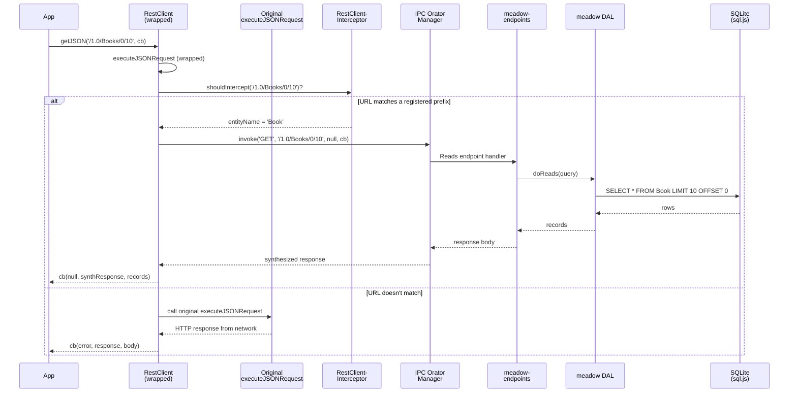
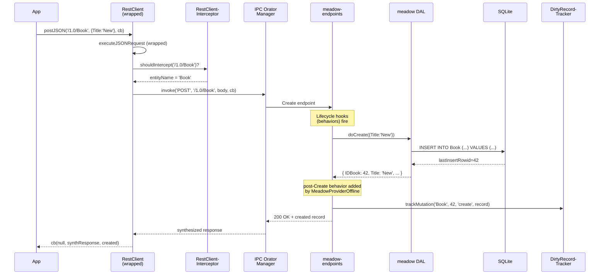
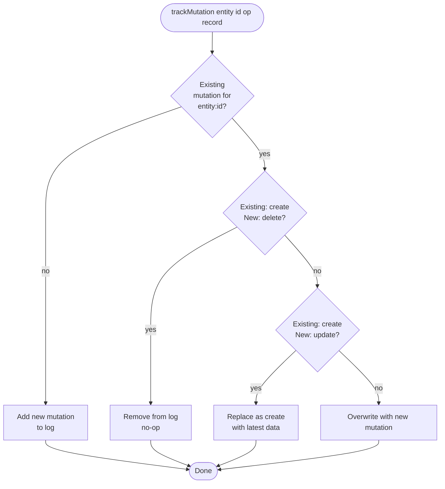
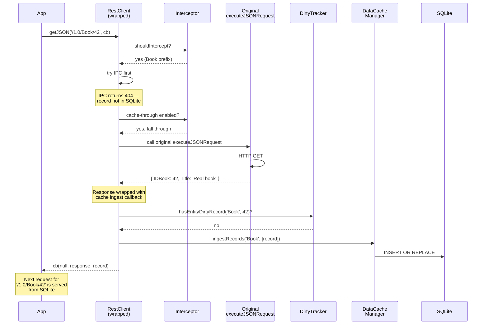
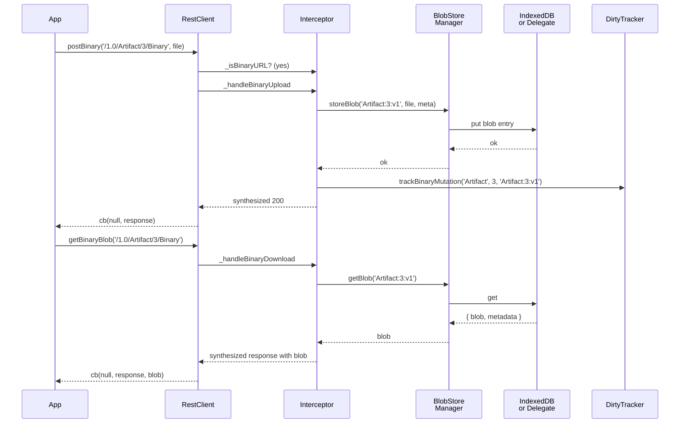
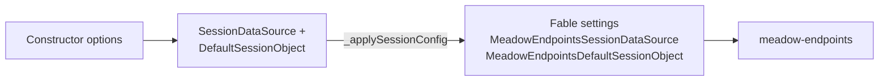

# Architecture

Meadow Provider Offline is built as five cooperating sub-services wrapped by an orchestrator. Each sub-service is a standalone Fable service provider and can be accessed directly for fine-grained control. This page walks through the components, the request lifecycle, the dirty-tracking flow, and the key design trade-offs.

## Layered Design

```
┌──────────────────────────────────────────────────────────────┐
│                            Fable                              │
│            (Service manager, RestClient, logging)             │
└─────────────────────────┬────────────────────────────────────┘
                          │
┌─────────────────────────▼────────────────────────────────────┐
│                    MeadowProviderOffline                      │
│                       (Orchestrator)                          │
└──┬──────────┬──────────────┬──────────────┬────────────┬─────┘
   │          │              │              │            │
┌──▼───┐  ┌───▼────┐  ┌──────▼──────┐ ┌─────▼──────┐ ┌───▼────┐
│ Data │  │  IPC    │  │ RestClient  │ │ DirtyRecord │ │  Blob  │
│ Cache│  │  Orator │  │ Interceptor │ │   Tracker   │ │  Store │
│ Mgr  │  │  Mgr    │  │             │ │             │ │  Mgr   │
└───┬──┘  └────┬────┘  └─────────────┘ └─────────────┘ └────┬───┘
    │          │                                             │
┌───▼──────────▼────┐                                  ┌────▼────┐
│  sql.js (WASM)    │                                  │IndexedDB│
│  or Native Bridge │                                  │or Delegate│
└───────────────────┘                                  └─────────┘
```

### Sub-Service Responsibilities

| Service | Responsibility |
|---------|----------------|
| `DataCacheManager` | Owns the in-memory SQLite database via `meadow-connection-sqlite-browser`. Creates / drops / resets tables, seeds data, ingests records. |
| `IPCOratorManager` | Owns an in-process Orator IPC server. Registers meadow-endpoints routes and handles staging of request bodies. |
| `RestClientInterceptor` | Wraps `RestClient.executeJSONRequest` in place, matches URLs against registered entity prefixes, and routes matches through IPC. |
| `DirtyRecordTracker` | In-memory log of local mutations with coalescing logic (create+delete=no-op, create+update=create). |
| `BlobStoreManager` | IndexedDB-backed binary storage for images, videos, and files. Supports an external delegate for iOS WKWebView. |

## Request Lifecycle — `getJSON`



The interception happens inside `executeJSONRequest`, which is where all the individual `getJSON` / `putJSON` / `postJSON` / `deleteJSON` methods converge. By wrapping there, we intercept every request type with a single replacement.

## Mutation Lifecycle — `postJSON`



Meadow Provider Offline patches each entity's endpoints with a **post-Create**, **post-Update**, and **post-Delete** lifecycle behavior that calls `dirtyTracker.trackMutation(...)` with the final record state. This happens inside the IPC pipeline, so the app never sees it — it just gets its normal response back.

## Dirty Tracker Coalescing



The two key rules:

1. **Create + Delete = no-op.** A record that was created offline and then deleted offline never needs to be synced — the server was never told about it in the first place.
2. **Create + Update = Create with latest data.** A record that was created offline and then edited offline should still sync as a single Create, with the final edited state.

All other pairs overwrite: an Update followed by an Update keeps the latest. A Delete followed by anything else overwrites (though in practice you shouldn't be updating deleted records).

## Cache-Through Flow



Cache-through enables "opportunistic offlining" — the app behaves normally online, reads flow through to the network, but every successful GET is silently cached into SQLite. The next time the same record is requested the response comes from the cache instantly. Dirty records are never overwritten — the local version is authoritative until it syncs.

## Binary / Blob Lifecycle

Binary uploads and downloads follow a parallel path routed through `BlobStoreManager`:



The same `connect()` call sets up both JSON and binary interception. Binary interception uses a parallel URL prefix check (`_isBinaryURL`) and a separate pair of wrappers on `executeBinaryUpload` and `executeChunkedRequest`.

## Configuration Flow



On instantiation, the provider reads its options and stamps them onto `fable.settings` so that the subsequent `meadow-endpoints` creation inside `addEntity()` picks them up. This is how the browser-side endpoints know to bypass session authentication and use the default session object.

## Component Reference

| Component | File | Lines |
|-----------|------|-------|
| `MeadowProviderOffline` | `source/Meadow-Provider-Offline.js` | ~1268 |
| `DataCacheManager` | `source/Data-Cache-Manager.js` | ~430 |
| `IPCOratorManager` | `source/IPC-Orator-Manager.js` | ~239 |
| `RestClientInterceptor` | `source/RestClient-Interceptor.js` | ~1050 |
| `DirtyRecordTracker` | `source/Dirty-Record-Tracker.js` | ~331 |
| `BlobStoreManager` | `source/Blob-Store-Manager.js` | ~621 |
| `MeadowProviderNativeBridge` | `source/Meadow-Provider-NativeBridge.js` | ~389 |
| `MeadowProviderOfflineBrowserShim` | `source/Meadow-Provider-Offline-Browser-Shim.js` | ~24 |

## Design Trade-Offs

**Why wrap RestClient instead of providing an alternative client?**
Because every model, view, and controller in an existing Fable application already talks to `RestClient`. Replacing it would mean touching every file that imports it. Wrapping means the offline layer can be bolted onto an existing app with zero changes to business logic — the interception is transparent.

**Why `sql.js` and not IndexedDB directly?**
`sql.js` gives us a real SQL engine in the browser, which means `meadow-endpoints` can execute the same foxhound queries as the server. IndexedDB is a key-value store and would require re-implementing a large fraction of meadow's query semantics. The trade-off is the WASM load (~600KB gzipped) and the fact that sql.js runs single-threaded — queries block the main thread. For apps with thousands of records that's still microseconds; for millions it may be an issue.

**Why dirty tracking in memory instead of persisting to IndexedDB?**
Simplicity and speed. Persistence is left as an application concern — the app can serialize `dirtyTracker.getDirtyMutations()` to IndexedDB or localStorage itself whenever it needs to. Building persistence into the tracker would force a choice of storage format and make replay semantics murky.

**Why negative IDs for offline creates?**
Because the alternative is either (a) picking IDs out of thin air and hoping they don't collide with server-assigned ones, or (b) deferring creates until the app reconnects. Negative IDs are a widely-used pattern: the client guarantees negative IDs are locally-generated and the server guarantees it never returns negative IDs, so the two never collide. When sync happens, each offline-created record gets remapped from its negative ID to the real positive ID the server assigned.

**Why a native bridge escape hatch?**
Because iOS WKWebView has historically been unreliable with IndexedDB, and running WASM inside an embedded webview can be slow and memory-hungry. The native bridge lets a host app (a Swift or Kotlin wrapper) provide SQLite directly, bypassing `sql.js` entirely. The provider still handles all the IPC wiring, dirty tracking, and interception logic.

**Why a BlobStorageDelegate escape hatch?**
Same reason — iOS WKWebView's IndexedDB has had bugs with blob storage specifically (large blobs sometimes disappear across page loads). A native host can store blobs in real filesystem paths and serve them back through a delegate interface.
